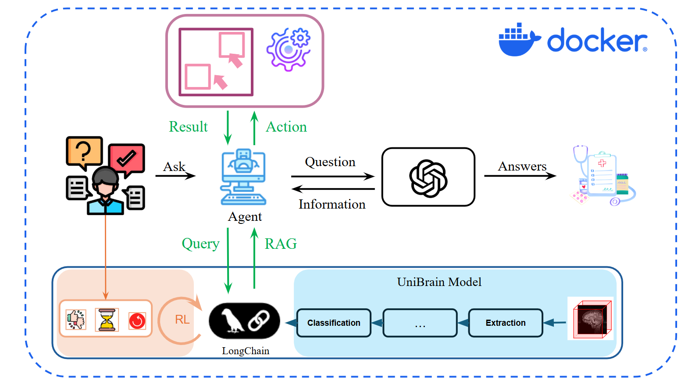
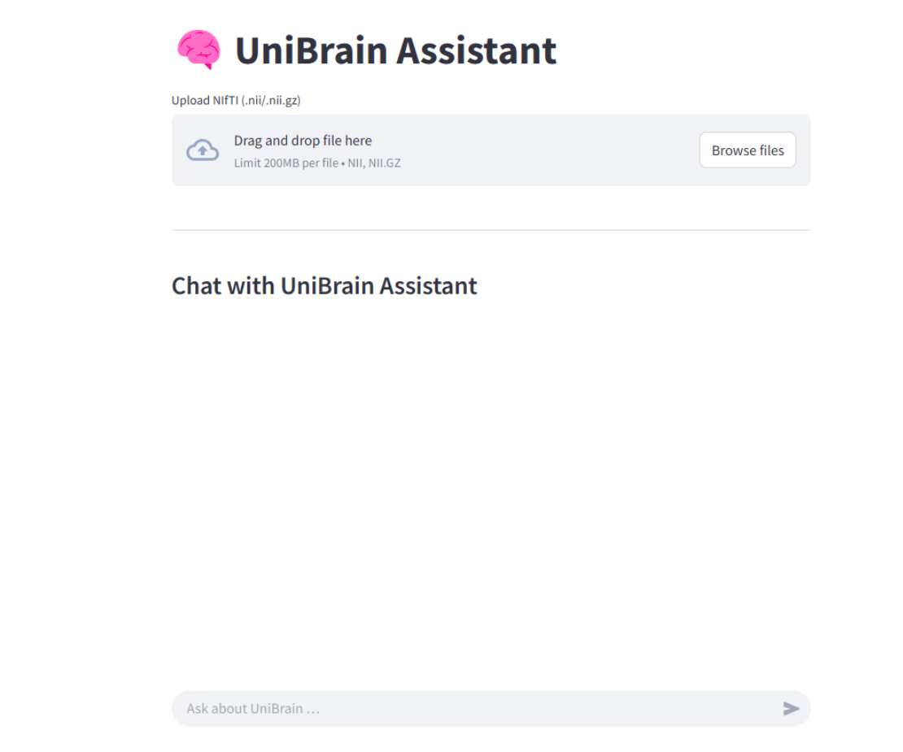
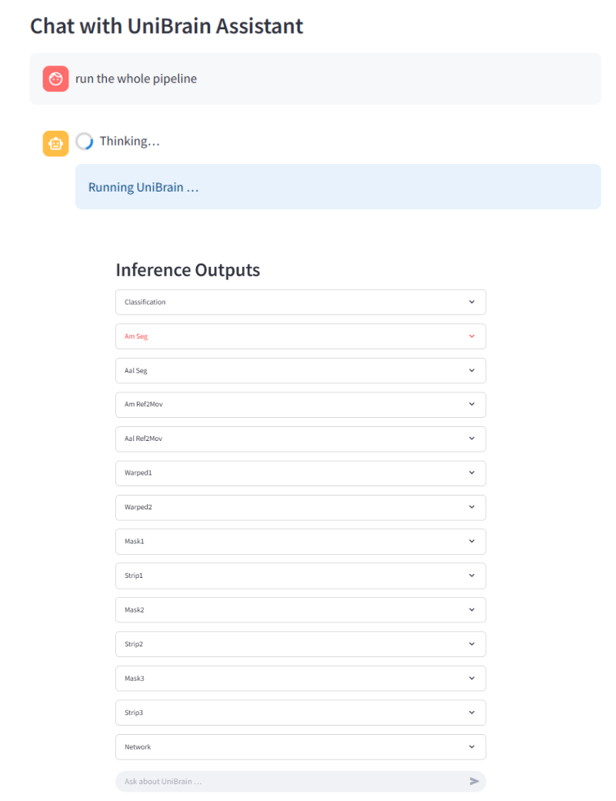
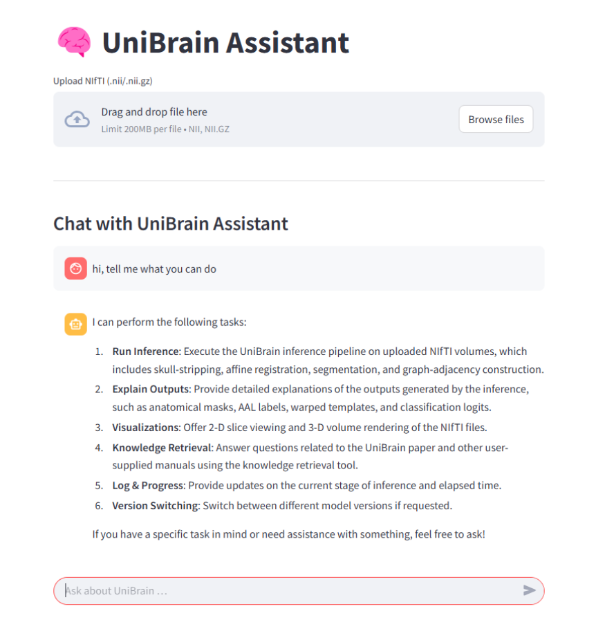
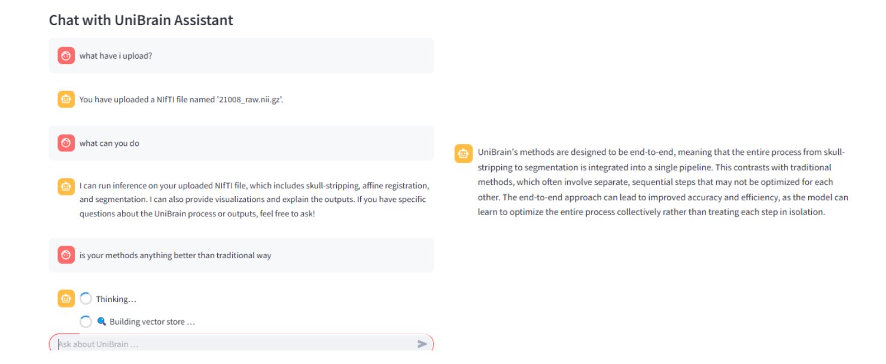
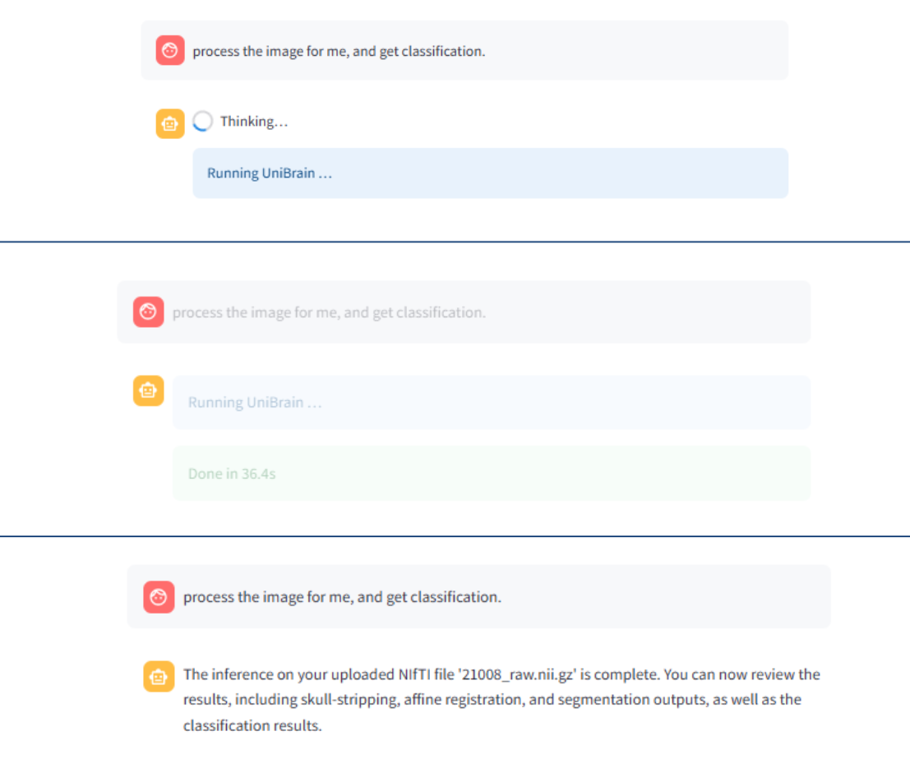

# 🧠 UniBrain‑Assistant


**UniBrain‑Assistant** is an open-source, browser-based platform that integrates end-to-end deep learning into a fully conversational workflow for structural brain MRI analysis.

### :rocket: Try Me - One Click, Done Quick!

You can drop in a NIfTI file, watch every preprocessing step unfold in real time, explore the resulting connectome interactively, and ask questions in plain English or any natural languages — all without leaving your web browser.

It pairs Streamlit’s reactive UI with LangChain’s tool‑calling so you can **see**, **tweak**, and **interrogate** each stage of the pipeline:

* skull‑stripping → affine registration → tissue segmentation → AAL parcellation → graph construction → disease classification
* fully **interactive**: 2D slice viewer, 3D Plotly volume, heat‑map / graph visualisations, one‑click downloads
* **pipeline orchestration by natural‑language** – e.g. `run the pipeline without segmentation`, `enable network`
* **RAG‑powered Q & A** over both your outputs **and** the UniBrain paper itself

### ⏳ We are working hard to enhance the tool, and a new version will be released soon.

---

## ✨ Key Features

| UI / UX                                     | Details                                                                                                     |
| ------------------------------------------- | ----------------------------------------------------------------------------------------------------------- |
| **Drag‑&‑drop NIfTI** (`.nii` / `.nii.gz`)  | Files stored under `uploads/<8‑char‑id>/` for easy cleanup                                                  |
| **Smart reruns**                            | Upload survives every Streamlit rerun – viewers and cards never disappear                                   |
| **Collapsible output cards**                | Keep the page tidy; expand only what you need                                                               |
| **2D/3D switch**                            | Fast slice slider **or** Plotly volume (quality slider + colour‑map)                                        |
| **Adjacency exploration**                   | Toggle *heat‑map* or *interactive network graph* (edge‑density slider)                                      |
| **Download buttons everywhere**             | NIfTI (`.nii.gz`) or raw PyTorch (`.pt`)                                                                    |
| **Sidebar “⚙️ Pipeline steps”** selector    | Tick/untick *Extraction, Registration, …* before running                                                    |
| **Natural‑language controller**             | `skip segmentation`, `reset steps`, `enable classification`, …                                              |
| **Chat assistant** (GPT‑4o‑mini by default) | • answers neuroscience questions via the RAG tool<br>• can call `run_unibrain_inference` tool automatically |

---

## 🏗️ Project Layout

```text
├─ app.py                  ← this Streamlit app (single‑file, self‑contained)
├─ assets/
│  ├─ tpl_img.npy          ← template volume
│  ├─ tpl_gm.npy           ← template GM mask
│  └─ tpl_aal.npy          ← template AAL labels
├─ model.py                ← UniBrain network (or drop‑in)
├─ prompts/
│  └─ unibrain_system_prompt.md
├─ unibrain.pdf            ← paper for RAG
└─ extra_knowledge.txt     ← any supplementary text you like
```

### 🔬 Method Structure

<p align="center">
  
</p>

> **No UniBrain weights?**
> If `assets/unibrain.pth` is missing the app loads a **dummy stub** so you can
> still explore the UI.

---

## 🚀 Quick Start

```bash
git clone https://github.com/<your‑handle>/unibrain-assistant.git
cd unibrain-assistant
python -m venv .venv && source .venv/bin/activate      # optional
pip install -r requirements.txt
export OPENAI_API_KEY="sk-..."                         # GPT‑4o‑mini / 3.5‑turbo
streamlit run app.py
```

Open [http://localhost:8501](http://localhost:8501) → upload a NIfTI → pick steps → **Run**.
Then talk to your data:

```
❯ without segmentation                 # skips Segmentation, re‑runs
❯ what does a high dice score mean?
❯ show me only the brain network stage
```

---

## 🔑 Environment Variables

| Var              | Purpose                                        |
| ---------------- | ---------------------------------------------- |
| `OPENAI_API_KEY` | Required for chat, command‑parser LLM, and RAG |
| `IMG_SIZE`       | (optional) override default 96³ voxel size     |

---

## 📦 Core Dependencies

* `streamlit ≥1.32`
* `torch`, `numpy`, `nibabel`, `SimpleITK`, `plotly`, `networkx`
* `langchain`, `langchain‑openai`, `faiss‑cpu`
* `openai` (≥1.0 python SDK)

See `requirements.txt` for exact versions.

---

## 🤖 Command Grammar (for reference)

| Intent          | Examples (case‑insensitive)                               |
| --------------- | --------------------------------------------------------- |
| **Skip step**   | `skip segmentation`, `no network`, `without registration` |
| **Enable step** | `enable classification`, `turn on parcellation`           |
| **Reset**       | `reset steps`, `reset pipeline`                           |
| Anything else   | routed to the regular chat assistant                      |

Internally the message goes through:

1. **Regex fast‑path**
2. If unresolved → **GPT‑4o‑mini** prompt (`CMD_SYS_PROMPT`) → JSON response.

---


---

## 🖼️ Demo

<p align="center">
  
  
  
</p>
<p align="center">
  
  
</p>


## 📝 Contributing

PRs are welcome! Interesting directions:

* plug‑in **non‑rigid** registration back‑ends
* support **multi‑modal** inputs (fMRI + DTI)
* switch 3‑D viewer to `vtk.js` for volume clipping planes
* add **batch mode** & progress bars


---

## 📚 Citation

Please cite the following work if UniBrain‑Assistant contributes to your research:

```bibtex
@article{su2025end,
  title={End-to-End Deep Learning for Structural Brain Imaging: A Unified Framework},
  author={Su, Yao and Han, Keqi and Zeng, Mingjie and Sun, Lichao and Zhan, Liang and Yang, Carl and He, Lifang and Kong, Xiangnan},
  journal={arXiv preprint arXiv:2502.18523},
  year={2025}
}
```


---

## 📄 License

MIT – do whatever you want, but please cite the UniBrain paper if you use the
model for research.

